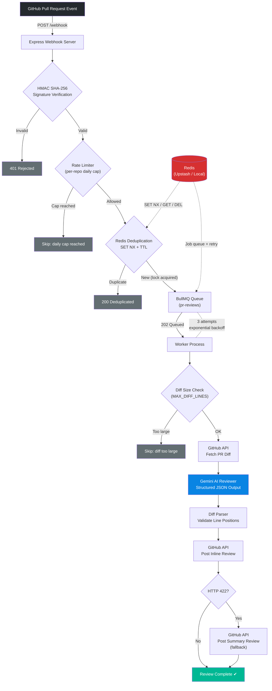

# pr-review-bot

A GitHub App that automatically reviews pull requests using the Gemini API
(free tier) and posts inline comments as a real PR review.

## How PullScout Works

Once configured, reviews happen automatically:

1. Install the PullScout GitHub App on a repository.
2. Open or update a pull request.
3. GitHub sends a `pull_request` webhook to PullScout.
4. PullScout verifies the webhook signature and applies the rate limit.
5. Redis prevents duplicate reviews for the same PR commit.
6. BullMQ queues the review for asynchronous processing.
7. Gemini analyzes the pull request diff.
8. PullScout posts the findings directly as inline comments on the GitHub pull request.

## What It Provides

- AI-powered pull request code review using Gemini
- Inline GitHub review comments
- Asynchronous processing with BullMQ
- Redis-backed duplicate review prevention
- Webhook HMAC-SHA256 verification
- Per-repository daily rate limiting
- Retry handling for failed jobs
- Diff-size limits and GitHub review fallbacks

## Architecture



The AI call is isolated in `src/services/aiReviewer.js` as a thin adapter —
`reviewDiff(diff) -> [{ file, line, severity, comment }]`. Swapping providers
(e.g. to Claude) later only means rewriting that one file.

## Setup

1. **Create a GitHub App**
   - Permissions: Pull requests (Read & write), Contents (Read-only)
   - Subscribe to event: `pull_request`
   - Generate a private key, save it as `private-key.pem` in the project root
   - Note the App ID and generate a webhook secret

2. **Get a free Gemini API key** at Google AI Studio (no card required)

3. **Install Redis locally** (or use a free Redis instance from Render/Railway)

4. **Configure environment**
   ```
   cp .env.example .env
   # fill in GITHUB_APP_ID, GITHUB_WEBHOOK_SECRET, GEMINI_API_KEY, etc.
   ```

5. **Install dependencies**
   ```
   npm install
   ```

6. **Run**
   ```
   npm start     # webhook server
   npm run worker  # queue worker, separate process
   ```

7. **Expose locally for testing** with a tunnel (e.g. `ngrok http 3000`) and
   point the GitHub App's webhook URL at `<tunnel-url>/webhook`.

## Docker Deployment

PullScout includes containerization support for local development and production cloud deployment.

### Prerequisites
- Docker Engine & Docker Compose installed.
- Valid `.env` configuration file populated (see `.env.example`).

### Running with Docker Compose (Local Dev)
Launch the Webhook Server, BullMQ Queue Worker, and Redis container concurrently:

```bash
# Build and start containers in detached mode
docker compose up -d --build

# View container logs
docker compose logs -f

# Stop containers
docker compose down
```

### Production / Remote Redis
For cloud platform deployments (e.g. Render, Railway, Fly.io), set `REDIS_URL` to point to your remote Redis instance (e.g. Upstash Redis) and launch the containers:
- **Webhook Server**: `docker run --env-file .env -p 3000:3000 pullscout-app`
- **Queue Worker**: `docker run --env-file .env pullscout-app node src/queue/worker.js`

## Cost / reliability guardrails

- `MAX_DIFF_LINES` — skips oversized diffs instead of sending them to the API
- `MAX_REVIEWS_PER_REPO_PER_DAY` — in-memory cap per repo, resets daily
- `DEDUPLICATION_TTL_SECONDS` — Redis-backed PR commit deduplication (default: 86400s / 24h) preventing duplicate review processing for identical PR commits
- BullMQ retries failed jobs (e.g. transient API errors) with backoff instead
  of dropping them silently

## Build order (for reference while developing)

1. Express server + webhook signature verification ✅
2. Fetch a diff with a hardcoded installation token, print it
3. Add Gemini call with a basic prompt, print the review
4. Split into queue + worker ✅
5. Structured output parsing + posting back as a real PR review ✅
6. Polish: rate-limit handling, error cases, review history
