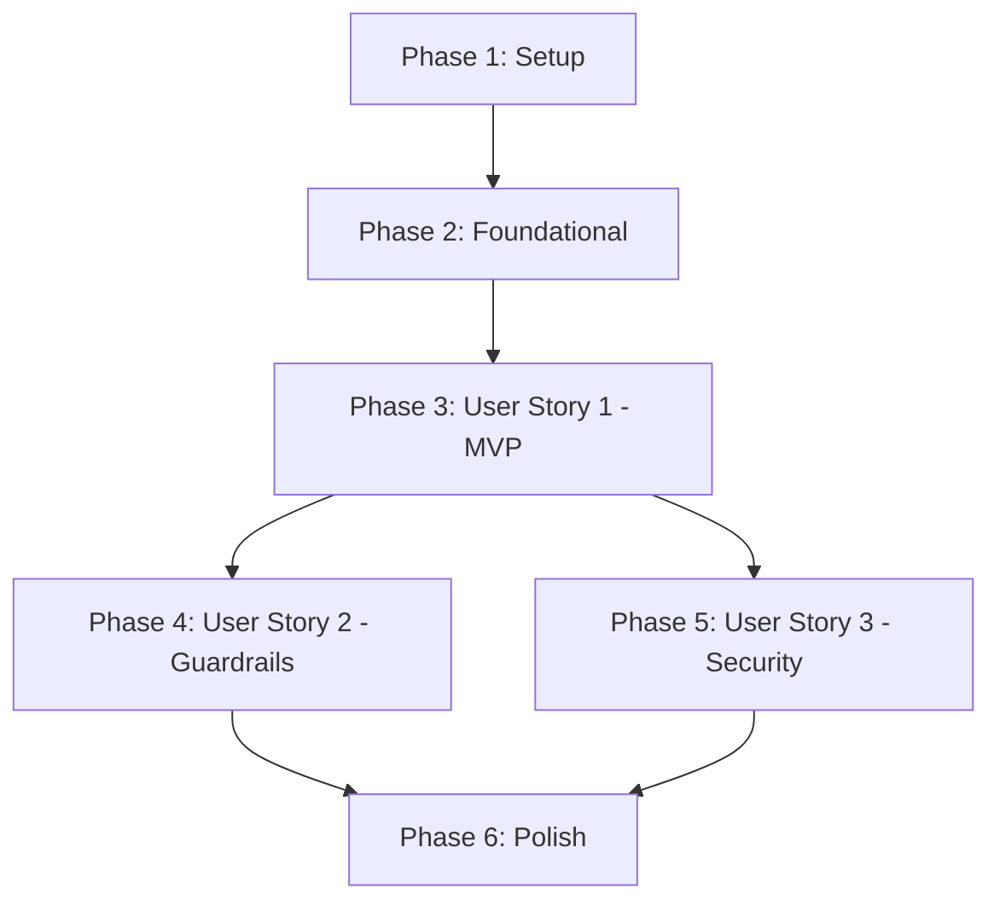

# Tasks: AI PR Reviewer Bot

**Input**: Design documents from `specs/001-ai-pr-reviewer/`
**Prerequisites**: [`plan.md`](file:///d:/Downloads/pr-review-bot_1/pr-review-bot/specs/001-ai-pr-reviewer/plan.md), [`spec.md`](file:///d:/Downloads/pr-review-bot_1/pr-review-bot/specs/001-ai-pr-reviewer/spec.md), [`data-model.md`](file:///d:/Downloads/pr-review-bot_1/pr-review-bot/specs/001-ai-pr-reviewer/data-model.md), [`contracts/`](file:///d:/Downloads/pr-review-bot_1/pr-review-bot/specs/001-ai-pr-reviewer/contracts/)

## Format: `[ID] [P?] [Story?] Description with file path`

- **[P]**: Can run in parallel (different files, no dependencies)
- **[Story]**: Maps task to user story from spec.md ([US1], [US2], [US3])

---

## Phase 1: Setup (Shared Infrastructure)

**Purpose**: Project initialization and basic configuration

- [ ] T001 Create project structure per implementation plan in `src/`
- [ ] T002 [P] Configure environment loading in `src/index.js` and `.env.example`

---

## Phase 2: Foundational (Blocking Prerequisites)

**Purpose**: Core queue and service adapters required before user stories can execute

- [ ] T003 Create Redis connection and BullMQ queue instance in `src/queue/queue.js`
- [ ] T004 [P] Implement GitHub App client auth and diff retrieval in `src/services/github.js`
- [ ] T005 [P] Implement Gemini AI thin adapter `reviewDiff` in `src/services/aiReviewer.js`

**Checkpoint**: Foundation ready - core AI and queue primitives are available

---

## Phase 3: User Story 1 - Automatic Inline Code Review on Pull Request (Priority: P1) 🎯 MVP

**Goal**: Webhook receives PR event, enqueues BullMQ job, fetches diff, runs Gemini review, and posts inline review comments to GitHub.
**Independent Test**: Send simulated webhook payload to `/webhook`, verify job enqueued and review comments posted.

- [ ] T006 [US1] Create webhook POST endpoint router in `src/routes/webhook.js` to enqueue PR jobs
- [ ] T007 [US1] Mount `/webhook` router in main Express application in `src/index.js`
- [ ] T008 [US1] Implement worker processing loop in `src/queue/worker.js` to fetch diffs and call `reviewDiff`
- [ ] T009 [US1] Implement inline review comment posting via Octokit in `src/services/github.js` and `src/queue/worker.js`
- [ ] T010 [US1] Test end-to-end webhook ingestion and review generation flow using `specs/001-ai-pr-reviewer/quickstart.md`

**Checkpoint**: User Story 1 (MVP) complete and independently testable

---

## Phase 4: User Story 2 - Operational Guardrails & Rate Limits (Priority: P2)

**Goal**: Protect LLM API quotas by skipping oversized diffs and enforcing daily per-repository review caps.
**Independent Test**: Submit diffs exceeding max line limits or repos over daily cap, verify worker logs skip status.

- [ ] T011 [P] [US2] Implement daily per-repo rate limit tracker in `src/utils/rateLimiter.js`
- [ ] T012 [US2] Add `MAX_DIFF_LINES` line count check to worker in `src/queue/worker.js`
- [ ] T013 [US2] Integrate `canReview` and `recordReview` checks into worker loop in `src/queue/worker.js`

**Checkpoint**: User Story 2 complete and guardrails active

---

## Phase 5: User Story 3 - Secure Webhook Authentication & Signature Validation (Priority: P3)

**Goal**: Authenticate all incoming webhooks using HMAC-SHA256 signature verification against `GITHUB_WEBHOOK_SECRET`.
**Independent Test**: Send webhook with invalid signature, verify HTTP 401 rejection before reaching queue.

- [ ] T014 [US3] Implement raw request body parsing verify callback in `src/index.js`
- [ ] T015 [US3] Implement HMAC-SHA256 signature verification in `src/routes/webhook.js`
- [ ] T016 [US3] Add HTTP 401 rejection logic for unauthenticated payloads in `src/routes/webhook.js`

**Checkpoint**: User Story 3 complete and security enforced

---

## Phase 6: Polish & Cross-Cutting Concerns

**Purpose**: Logging, diagnostics, and documentation validation

- [ ] T017 [P] Add structured log formatting and worker completion/failure event handlers in `src/queue/worker.js`
- [ ] T018 [P] Validate quickstart documentation and execution instructions in `specs/001-ai-pr-reviewer/quickstart.md`

---

## Dependencies & Execution Order

### Parallel Opportunities

- **Phase 1**: T002 can run in parallel with T001
- **Phase 2**: T004 (`github.js`) and T005 (`aiReviewer.js`) can be implemented in parallel
- **Phase 4**: T011 (`rateLimiter.js`) can be created in parallel with other guardrail logic
- **Phase 6**: T017 and T018 can run in parallel
